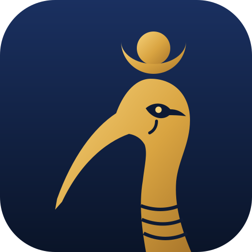
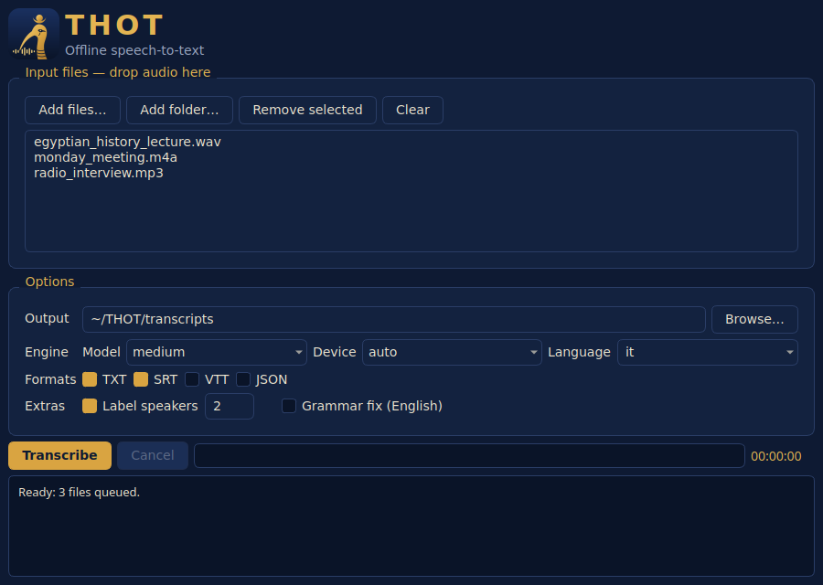

<p align="center">
  
</p>

<h1 align="center">THOT</h1>

<p align="center"><em>Offline speech-to-text — from sound to writing.</em></p>

Thoth, the ibis-headed Egyptian god, was the scribe of the gods: he listened and put words into writing.
**THOT** does the same with your audio files, entirely on your machine.

- **Batch transcription** of files and folders with [faster-whisper](https://github.com/SYSTRAN/faster-whisper) (CPU or CUDA GPU)
- **Lightweight speaker labelling** (MFCC + clustering), consistent across the whole file
- **Outputs** `txt`, `srt`, `vtt`, `json`
- **Live dictation** from the microphone with [Vosk](https://alphacephei.com/vosk/)
- **Desktop GUI** (PyQt5) with drag & drop, progress and cancellation
- **Optional grammar correction** (T5 model, English only)

## Installation

Requires Python ≥ 3.9. A system FFmpeg is not needed (decoding uses PyAV).

```bash
git clone https://github.com/gc10code/thot.git
cd thot
scripts/install.sh            # creates .venv and installs with GUI + live extras
source .venv/bin/activate
```

On Windows: `scripts\install.bat`. Manual install with the extras you need:

```bash
pip install -e ".[gui,live]"      # extras: gui, live, grammar, all, dev
```

## Usage

### Transcription

```bash
thot transcribe interview.mp3                     # → transcripts/interview.txt
thot transcribe recordings/ -o out -f srt -f txt  # whole folder, several formats
thot transcribe meeting.m4a -s 3 -m medium        # 3 speakers, medium model
thot transcribe talk.mp4 -l auto -d cuda          # auto-detect language, GPU
```

| Option | Description | Default |
|---|---|---|
| `-o, --output` | output folder | `transcripts` |
| `-m, --model` | `tiny` `base` `small` `medium` `large-v3` `turbo` | `small` |
| `-l, --language` | language code (`it`, `en`, …) or `auto` | `it` |
| `-d, --device` | `auto` `cpu` `cuda` | `auto` |
| `-f, --format` | `txt` `srt` `vtt` `json` (repeatable) | `txt` |
| `-s, --speakers N` | label N speakers (0 = off) | `0` |
| `-g, --grammar` | T5 grammar correction (English) | off |
| `-r, --recursive` | search subfolders | off |
| `--no-vad` | disable voice-activity filtering | — |

Whisper models are downloaded automatically on first use.

### Desktop GUI

```bash
thot gui        # or: thot-gui
```

<p align="center"></p>

### Live dictation

```bash
scripts/download_vosk_model.sh        # small Italian model (48 MB) into models/
thot live                             # speak; Ctrl+C to stop
thot live -o notes.txt -i 2           # also save to a file, use input device 2
thot live --list-devices
```

Pick a model with `-M <folder>` or the `THOT_VOSK_MODEL` environment variable. See [models/README.md](models/README.md).

## Project layout

```
src/thot/
├── config.py            shared constants and enums
├── core/                engine, no UI dependencies
│   ├── audio.py         decoding (PyAV) and file discovery
│   ├── transcriber.py   Whisper pipeline with progress and cancellation
│   ├── diarization.py   speaker labelling
│   ├── grammar.py       T5 correction (loaded only when used)
│   ├── formatters.py    txt / srt / vtt / json
│   └── models.py        Segment, Transcript
├── cli/                 `thot transcribe | live | gui`
├── gui/                 PyQt5 window and background worker thread
└── resources/           icon and stylesheet
```

## Development

```bash
pip install -e ".[dev]"
pytest
```

## License

[MIT](LICENSE)
